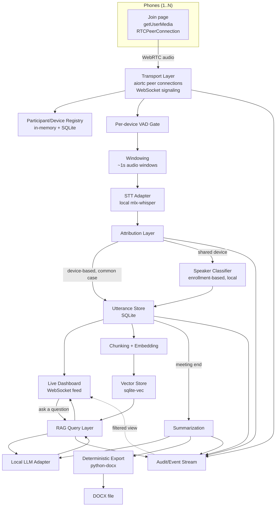

# Architecture

## Purpose

Convene is a single-laptop, offline-first meeting intelligence system: phones stream microphone audio over local Wi-Fi via WebRTC, the laptop transcribes and attributes each utterance to its speaker with confidence scoring, serves a live dashboard with in-meeting Q&A, and produces a speaker-labeled summary and exportable minutes at meeting end. See `project-context.md` for the one-paragraph pitch; this document is the detailed component reference.

## Architectural principles (locked)

- Speaker attribution comes from device identity first, ML classification only for the shared-device exception (ADR-02, ADR-03).
- Every utterance carries a confidence score and is correctable — never silently authoritative (ADR-04).
- Models are resolved through resource types, never referenced by name in application logic (ADR-14).
- Local execution is the default path for every model; cloud is opt-in and never in the automatic critical path (ADR-06).
- Retrieval (RAG) is always an explicit, user-triggered action (ADR-11).
- Export generation is deterministic — the model produces data, code produces the file (ADR-12).
- One audit/event stream is the single source of truth for what happened and when (ADR-13).
- The system operates fully offline after phones and laptop are on the same local network.
- Every participant/device is isolated — one device's failure must not affect any other.

## Component architecture

## Responsibilities and boundaries

| Component | Responsible for | NOT responsible for |
|---|---|---|
| Phone client (join page) | Mic capture, peer connection, reconnect, sending its own identity/sharing declaration | Any server-side logic, storage, or attribution decisions |
| Transport Layer | Signaling, peer connection lifecycle, per-device audio frame delivery, reconnect handling | Interpreting audio content in any way |
| Participant/Device Registry | Mapping device↔participant↔meeting, shared-device flags | Attribution confidence or classification logic |
| VAD Gate | Deciding whether a window has enough signal to be worth processing | Identifying *who* is speaking |
| Windowing | Producing ~1s audio windows per device from a continuous stream | STT itself |
| STT Adapter | Converting an audio window to text for one device | Deciding which participant said it |
| Attribution Layer | Assigning a participant + confidence + method to every transcribed window | Running STT or the speaker classifier itself (delegates to both) |
| Speaker Classifier (shared-device) | Enrollment storage, embedding comparison, generic-label fallback | Attribution for non-shared devices (handled directly by device identity) |
| Utterance Store | Persisting the ordered, attributed transcript | Deciding correctness — correction is a separate explicit action |
| Live Dashboard | Rendering the live transcript, connection health, correction controls, Q&A input | Any storage or model inference — it only renders and calls existing APIs |
| Chunking + Embedding | Turning stored utterances into retrievable chunks with vectors | Deciding when retrieval happens (RAG layer decides, on explicit trigger) |
| Vector Store | Similarity search over chunk embeddings | Generating answers |
| RAG Query Layer | Retrieving relevant chunks, constructing context, invoking the LLM, citing sources | Running automatically or without an explicit query |
| Local LLM Adapter | Resolving a resource type to a live local model and running inference (summarization or QA) | Knowing why a caller needs it, or touching document formatting |
| Summarization | Producing structured summary + action-item data from a full transcript | Rendering the final document (Export does that) |
| Deterministic Export | Rendering structured summary data into a DOCX file from a fixed template | Composing the content itself |
| Audit/Event Stream | Recording every event of interest, timestamped | Making any decisions |

## Meeting lifecycle

`created` → `live` → `ended`. A meeting is created when the first join request generates a meeting ID (or a meeting ID is pre-created and shared as a link/QR code), moves to `live` on the first successful device connection, and moves to `ended` on an explicit end action (which triggers summarization). See `data-model.md` for the full `Meeting` schema.

## Device/participant lifecycle

`joining` → `connected` → (`disconnected` ⇄ `reconnected`) → `left`. A reconnect under the same `participant_id` never creates a new logical participant (inherited from DT-17's transport guarantee). If a device declared itself shared, it additionally passes through `enrolling` before `connected`.

## Utterance lifecycle

`transcribed` (STT produced text) → `attributed` (participant + confidence + method assigned) → optionally `corrected` (a manual reassignment, which is recorded, not overwritten silently — the original attribution is retained in the audit stream). See `speaker-attribution.md` for the full state machine on the shared-device path.

## Request/data lifecycle (live transcription path)

1. Device streams continuous audio over its `RTCPeerConnection` → Transport Layer tags every frame with `device_id`.
2. Per-device VAD gate evaluates rolling signal; windows that don't clear the threshold are dropped (never sent to STT).
3. Windowing layer emits an ~1s window with `device_id`, `t_start`, `t_end`.
4. STT Adapter transcribes the window → `{text, stt_confidence}`.
5. Attribution Layer checks whether the device is shared:
   - Not shared → attribute directly to the device's participant, `method = "device"`, `confidence = high` (fixed).
   - Shared → pass to Speaker Classifier; result is either an enrolled participant with a similarity-derived confidence, or a generic per-device label with `confidence = low`.
6. Utterance persisted to the store, `audit_event: utterance_created` fired.
7. Utterance pushed to the live dashboard over its WebSocket feed.
8. Utterance queued for chunking/embedding asynchronously (does not block the live path).

## Request/data lifecycle (Q&A path)

1. User submits a question via the dashboard, scoped to `mode: live` (current meeting only) or `mode: history` (across meetings).
2. RAG Query Layer embeds the question (same embedding resource type as ingestion).
3. Vector similarity search against `sqlite-vec`, scoped by meeting(s) per the mode.
4. Retrieved chunks (each carrying participant/timestamp metadata) are assembled into context.
5. Local LLM Adapter generates an answer grounded in that context; if no chunks meet a relevance threshold, the honest response is "no grounding found," never a fabricated answer from general model knowledge (mirrors the RAG honesty test pattern in `testing.md`).
6. Answer + cited utterances returned to the dashboard, `audit_event: qa_query` fired.

## Request/data lifecycle (summarization/export path)

1. Meeting end (explicit action) triggers summarization.
2. Full attributed transcript (including corrections) assembled and passed to the Local LLM Adapter with a constrained-output prompt.
3. LLM returns structured `{summary, action_items[]}` — never free-form document markup.
4. Deterministic Export renders that structured data into a DOCX using a fixed template.
5. File stored under `data/exports/`, referenced by an `Export` row, available for download from the dashboard.

## Failure boundaries

| Failure | Handling |
|---|---|
| A single device disconnects | Transport Layer marks it `disconnected`; all other devices continue unaffected; reconnect resumes under the same `participant_id` |
| STT fails on one window | That window is marked `failed`, logged, transcript continues with the next window — never blocks or crashes the pipeline for that device or any other |
| Enrollment audio too short/noisy to embed | Device falls back to the generic-label attribution path for that speaker slot, flagged low-confidence, never blocks the meeting from starting |
| Local LLM fails to load or errors mid-generation | Summarization/QA call marked `failed`, error surfaced to the dashboard; live transcription is unaffected (different resource type, independent failure domain) |
| Vector store query error | RAG query returns a failed result to the caller, never a silent empty "no results" — the UI must be able to distinguish "nothing relevant" from "retrieval itself broke" |
| Export rendering error | Export marked `failed`, summary data itself is preserved and still viewable in the dashboard even if the DOCX render fails |
| Malformed signaling message | Rejected at the Transport Layer before reaching any other component; connection for that device is reset, other devices unaffected |

## Tradeoffs (explicit)

| Choice | What we gained | What we gave up |
|---|---|---|
| Device-based attribution over full acoustic diarization | Reliable common case, explainable to judges, no ML uncertainty for most speakers | Doesn't solve cross-device bleed (handled separately by VAD, not by this choice) |
| Enrollment-based classification over blind clustering for shared devices | Materially more reliable than unsupervised diarization, fails safely | Extra join-flow step; depends on enrollment sample quality |
| Local-first models | No rate-limit risk in the critical demo path, zero per-meeting cost, offline claim is literally true | Slightly lower summarization quality ceiling than the largest cloud models |
| SQLite + sqlite-vec, single file | Minimal ops burden, one thing to back up/debug live | No real multi-writer concurrency, not built for scale beyond one laptop |
| Single Python process (FastAPI + aiortc) | Simpler debugging, no cross-language IPC | Smaller WebRTC ecosystem/community than Node's |
| Deterministic export rendering | Export can never be malformed by a model, easy to reskin | Less flexible formatting than letting a model author the document directly |

## Architectural decisions

See `decisions.md` for the full ADR set — every non-obvious choice above has a corresponding entry with rationale and alternatives considered.
