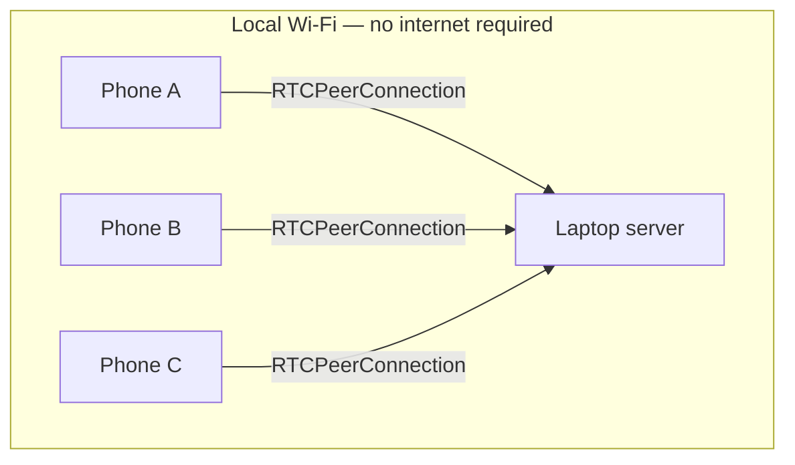

# Transport Layer

This layer is inherited from the validated DT-17 prototype (see `project-context.md`). Nothing here is being redesigned — this document formalizes what was already proven to work into the format used across this doc set, so it can be referenced by `architecture.md` and `speaker-attribution.md` without re-deriving it.

## Scope

Get continuous, low-latency audio from N phones to the laptop, with reliable per-device identity and automatic recovery from normal Wi-Fi interruptions. Nothing about content (transcription, attribution) happens in this layer.

## Why WebRTC over WebSocket/MediaRecorder

WebRTC's media transport is designed for real-time audio: jitter handling, packet-loss concealment, and low latency, at the cost of not guaranteeing every packet. A WebSocket + `MediaRecorder` chunk approach was considered and rejected — imprecise chunk timing, browser codec/container variability, and TCP head-of-line blocking under loss all work against the "fresh, continuous, intelligible audio" goal. WebSocket is used only for signaling (ADR-09).

## Topology

One `RTCPeerConnection` per device, direct phone-to-laptop. No peer-to-peer phone mesh, no cloud SFU, no phone relaying another phone's audio.



## Signaling

One WebSocket per device at `/ws/signal/{meeting_id}` (`api.md`). It carries signaling only; audio never travels over it (ADR-09). Signaling state is in memory; persistent identity lives in `Device`/`Participant` (`data-model.md`). The meeting comes from the URL path and is not repeated in any message. Field names are `snake_case`, the same as the REST API and the data model (ADR-16).

A device must be **registered over REST first** (`POST /api/meetings/{meeting_id}/devices`, `api.md`). REST creates the `Device` and `Participant` rows; the WebSocket only attaches a connection to an already-registered device. A `join` for an unregistered `device_id` is rejected.

### Message catalog

| type | direction | fields |
|---|---|---|
| `join` | client → server | `device_id` |
| `offer` | client → server | `sdp`, `ice_restart` (optional boolean, default false) |
| `leave` | client → server | none |
| `joined` | server → client | `device_id`, `participant_ids`, `device_status`, `reconnect_count`, `is_reconnect`, `peer_active` |
| `answer` | server → client | `sdp` |
| `error` | server → client | `code`, `message`, `fatal` |
| `meeting_ended` | server → client | none |

There is no `ice-candidate` message and no separate `reconnect` message (ADR-16): ICE is non-trickle, and `join` serves both a first attach and a reconnect because the server, not the client, knows which it is.

<!-- example: ws=signal-client -->
```json
{ "type": "join", "device_id": "7f3a9c52-1e84-4d6b-a0b7-3c5d9e2f4a18" }
{ "type": "offer", "sdp": "v=0\r\no=- 4611731400430051336 2 IN IP4 127.0.0.1\r\n...", "ice_restart": false }
{ "type": "leave" }
```

<!-- example: ws=signal-server -->
```json
{
  "type": "joined",
  "device_id": "7f3a9c52-1e84-4d6b-a0b7-3c5d9e2f4a18",
  "participant_ids": ["3e8b1d47-52a9-4c60-b7f2-0a9c6d4e8b15"],
  "device_status": "joining",
  "reconnect_count": 0,
  "is_reconnect": false,
  "peer_active": false
}
{ "type": "answer", "sdp": "v=0\r\no=- 3998979339 3998979339 IN IP4 0.0.0.0\r\n..." }
{ "type": "error", "code": "device_not_registered", "message": "device 7f3a9c52-1e84-4d6b-a0b7-3c5d9e2f4a18 is not registered for this meeting", "fatal": true }
{ "type": "meeting_ended" }
```

(The `sdp` strings above are shortened for readability; real SDP is a complete session description.)

### Flows

**First connection:** `POST /devices` → open the WebSocket → `join` → `joined` (`is_reconnect: false`) → `offer` → `answer` → media flows and the device becomes `connected` when its peer connection reaches `connected`.

**Reconnect:** open a new WebSocket → `join` → `joined` with `is_reconnect: true` and `peer_active` telling the client whether the server still holds a usable peer for this device. If `peer_active` is true and the client still has its `RTCPeerConnection`, it attempts an ICE restart: an `offer` with `ice_restart: true` on the same peer connection. If `peer_active` is false, the restart is refused, or it does not reach `connected` within the client's timeout, the client creates a fresh `RTCPeerConnection` and sends a plain `offer`; the server closes the old peer and answers the new one. Either way the device keeps its `device_id`, its `Participant`, and its transcript history.

**Leaving:** `leave` closes that device's peer, sets `Device.status = left`, and records `device_left`. A later `join` for the same `device_id` resumes as the same participant.

**Meeting end:** the server sends `meeting_ended` to every attached socket, closes their peers, and closes the sockets normally (code 1000). The phone page shows "meeting ended" and stops retrying. A `join` for an ended meeting gets `error` `meeting_ended`.

### Errors and isolation

`error.fatal = true` means the server closes this WebSocket (close code `4400`) after sending it, and, if the device had already joined, closes that device's peer connection too (the "reset" in `architecture.md`). `fatal = false` leaves the socket open. In both cases only the offending device is affected; no other device's socket, peer, VAD gate, or windows are touched, and the server process keeps running. Every error is also written as a `signaling_error` audit event.

| code | fatal | when |
|---|---|---|
| `invalid_message` | yes | not valid JSON, not a JSON object, a missing/ill-typed field, or a text frame over the size limit |
| `unknown_message_type` | yes | `type` not in the client-to-server rows above (this includes `ice-candidate` and `reconnect`) |
| `not_joined` | yes | `offer` or `leave` before a successful `join` |
| `meeting_not_found` | yes | the path meeting does not exist |
| `meeting_ended` | yes | `join` for an ended meeting |
| `device_not_registered` | yes | `join` for a `device_id` not registered in this meeting |
| `invalid_sdp` | yes | `sdp` is not a string, exceeds 100000 characters, or does not parse to a description with an audio section |
| `no_active_peer` | no | `offer` with `ice_restart: true` when the server has no usable peer for the device |
| `renegotiation_failed` | no | the ICE-restart offer could not be applied |
| `internal_error` | yes | an unexpected server-side failure while handling this device's message |

A binary WebSocket frame is treated as `invalid_message`. (The DT-17 prototype ignored binary frames, answered a malformed `sdp` with an empty answer, and kept the socket open after every error; CON-01 recorded those in `logs/transport.md`.)

## ICE/STUN/TURN

None required or used (ADR-10) — every device is on the same local network. Prefer local host candidates. ICE is **non-trickle** (ADR-16, carried from the DT-17 prototype): each side sends one complete session description containing all its candidates, so the signaling protocol needs no candidate messages. The phone waits for ICE gathering to complete (with a cap of a few seconds) before sending its `offer`; with no ICE servers configured, gathering only lists local host candidates and completes quickly. If a target browser requires a specific local ICE configuration, document it rather than introducing internet-facing infrastructure to work around it.

## Identity and reconnection

- `device_id` is a UUID generated by the phone on its first visit to a meeting's join page and stored in that browser's `localStorage` under `convene:<meeting_id>:device_id`. A page reload, a closed and reopened tab, or a brief network drop presents the same `device_id` and resumes as the same logical device; a new logical participant must never appear because a connection dropped. (The prototype used `sessionStorage`, which loses identity when the tab closes; CON-01 finding 12.)
- The server issues `participant_id` at registration. The phone never chooses it.
- Every re-attach of a device that has connected before counts as a reconnect: it increments `Device.reconnect_count` and fires a `device_reconnected` audit event whose payload records `via` (`ice_restart` or `new_peer`), the remote address, and the user agent.
- **The signaling socket and the peer connection have separate lifetimes.** Closing the WebSocket alone does not change the device's status and does not close its peer, because media may still be flowing and an ICE restart needs a peer to restart. Device status follows the peer connection: it becomes `disconnected` when the peer's connection state is `disconnected`, `failed` or `closed` (`device_disconnected`, with the reason), and back to `connected` when a peer reaches `connected` again. The server closes a `failed` peer. A device whose peer and socket are both gone stays `disconnected` until it rejoins, `leave`s, or the meeting ends. (The prototype closed the peer when its socket closed and mapped state directly from the socket; this is a change, owned by CON-04, and must be verified on real phones with the Wi-Fi interruption checks R3 and R4 in `logs/transport.md`.)
- A short audio gap while recovering is acceptable; each gap is recorded as `device_audio_resumed` with `gap_ms`.
- **Impersonation (accepted limitation, ADR-15, proposed):** `device_id` is a bearer identifier with no secret. Any client on the LAN that learns a device's UUID (the dashboard displays them) can `join` as that device and displace its connection. This is accepted for a single room with no accounts (ADR-10). It is visible after the fact through `device_reconnected` audit events and the dashboard's reconnect counter, and any resulting mislabeled line is correctable.

## Failure isolation

One device's connection failure, malformed message, or browser crash must never affect any other device's stream or the server process as a whole. This is enforced structurally: each device's peer connection, VAD gate, and windowing state are independent objects with no shared mutable state between devices.

## HTTPS / secure context requirement

`getUserMedia()` requires a secure context on essentially all modern mobile browsers — `http://<lan-ip>` will not be granted microphone access. The laptop serves HTTPS using a locally-trusted development certificate (`mkcert`), with the certificate covering whatever hostname/IP the phones actually connect to. Full platform-specific trust steps (Android/iOS) are operational setup, not architecture, and belong in a setup runbook rather than this document — see `deployment.md`.

## Network addressing

The server binds to `0.0.0.0:<port>`, not only `127.0.0.1`; the join URL/QR code uses the laptop's actual LAN address, detected and displayed at startup. No hard-coded IP. The join URL is `https://<lan-address>:<port>/join/<meeting_id>` and is returned by `POST /api/meetings` together with an inline QR code (`api.md`). If no LAN address is detected the server still starts, says so loudly, and returns `null` join fields with a warning rather than inventing an address; the operator supplies one through configuration.

## Metrics carried forward

Per device, minimum: connection state, last-audio-age, reconnect count, total received audio duration, audio gaps. They come from two sources (`data-model.md`, "Derived state and live gauges"):

- **Durable, from the audit stream:** connection state, reconnect count, and audio gaps (each `device_audio_resumed` event carries `gap_ms`). Also written as `ConnectionEvent` rows for post-hoc review.
- **Live gauges, in memory only:** `last_audio_age_ms` and `audio_duration_s`, served by `GET /api/meetings/{meeting_id}` and pushed as `device_gauges` on the dashboard feed. Last-audio-age is time since the last received frame, **not** one-way latency (`logs/transport.md`, finding 2).

## What this layer explicitly does not do

- Does not interpret audio content in any way (no VAD, no STT — those begin in the next layer, see `stt-pipeline.md`).
- Does not decide speaker attribution (see `speaker-attribution.md`).
- Does not persist audio by default — only structured metadata and, downstream, transcribed text. If raw audio recording is ever needed for debugging, it must be an explicit, opt-in debug flag, never default behavior.
