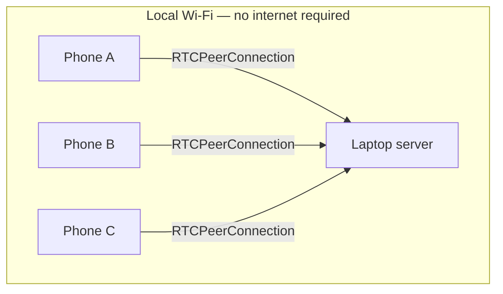

# Transport Layer

This layer is inherited from the validated DT-17 prototype (see `project-context.md`). Nothing here is being redesigned — this document formalizes what was already proven to work into the format used across this doc set, so it can be referenced by `architecture.md` and `speaker-attribution.md` without re-deriving it.

## Scope

Get continuous, low-latency audio from N phones to the laptop, with reliable per-device identity and automatic recovery from normal Wi-Fi interruptions. Nothing about content (transcription, attribution) happens in this layer.

## Why WebRTC over WebSocket/MediaRecorder

WebRTC's media transport is designed for real-time audio: jitter handling, packet-loss concealment, and low latency, at the cost of not guaranteeing every packet. A WebSocket + `MediaRecorder` chunk approach was considered and rejected — imprecise chunk timing, browser codec/container variability, and TCP head-of-line blocking under loss all work against the "fresh, continuous, intelligible audio" goal. WebSocket is used only for signaling (ADR-09).

## Topology

One `RTCPeerConnection` per device, direct phone-to-laptop. No peer-to-peer phone mesh, no cloud SFU, no phone relaying another phone's audio.



## Signaling

WebSocket connection per device, in-memory state (no database needed for signaling itself — persistent identity lives in `Device`/`Participant`, per `data-model.md`).

Message shapes:

```json
{ "type": "join", "meetingId": "MTG-123", "deviceId": "d01", "isShared": false, "declaredSpeakerCount": 1 }
{ "type": "offer", "sdp": "..." }
{ "type": "answer", "sdp": "..." }
{ "type": "ice-candidate", "candidate": "..." }
{ "type": "reconnect", "meetingId": "MTG-123", "deviceId": "d01" }
```

## ICE/STUN/TURN

None required or used (ADR-10) — every device is on the same local network. Prefer local host candidates. If a target browser requires a specific local ICE configuration, document it rather than introducing internet-facing infrastructure to work around it.

## Identity and reconnection

- `device_id` is generated client-side on first join and persisted in the phone's local storage for the session, so a reconnect (page reload, brief network drop) can present the same `device_id` and resume as the same logical device rather than creating a new one.
- On `disconnected`/`failed` connection state: attempt ICE restart/renegotiation first; if that fails, create a fresh `RTCPeerConnection` and reattach the microphone track under the same `device_id`. A short audio gap during this is acceptable; a new logical participant appearing is not.
- Every reconnect increments `Device.reconnect_count` and fires a `device_reconnected` AuditEvent.

## Failure isolation

One device's connection failure, malformed message, or browser crash must never affect any other device's stream or the server process as a whole. This is enforced structurally: each device's peer connection, VAD gate, and windowing state are independent objects with no shared mutable state between devices.

## HTTPS / secure context requirement

`getUserMedia()` requires a secure context on essentially all modern mobile browsers — `http://<lan-ip>` will not be granted microphone access. The laptop serves HTTPS using a locally-trusted development certificate (`mkcert`), with the certificate covering whatever hostname/IP the phones actually connect to. Full platform-specific trust steps (Android/iOS) are operational setup, not architecture, and belong in a setup runbook rather than this document — see `deployment.md`.

## Network addressing

The server binds to `0.0.0.0:<port>`, not only `127.0.0.1`; the join URL/QR code uses the laptop's actual LAN address, detected and displayed at startup. No hard-coded IP.

## Metrics carried forward

Per-device, minimum: connection state, last-audio-age, reconnect count, total received audio duration, audio gaps. These feed the live dashboard's connection-health panel (`frontend.md`) and are also written as `ConnectionEvent` rows (`data-model.md`) for post-hoc review.

## What this layer explicitly does not do

- Does not interpret audio content in any way (no VAD, no STT — those begin in the next layer, see `stt-pipeline.md`).
- Does not decide speaker attribution (see `speaker-attribution.md`).
- Does not persist audio by default — only structured metadata and, downstream, transcribed text. If raw audio recording is ever needed for debugging, it must be an explicit, opt-in debug flag, never default behavior.
