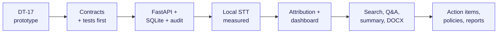
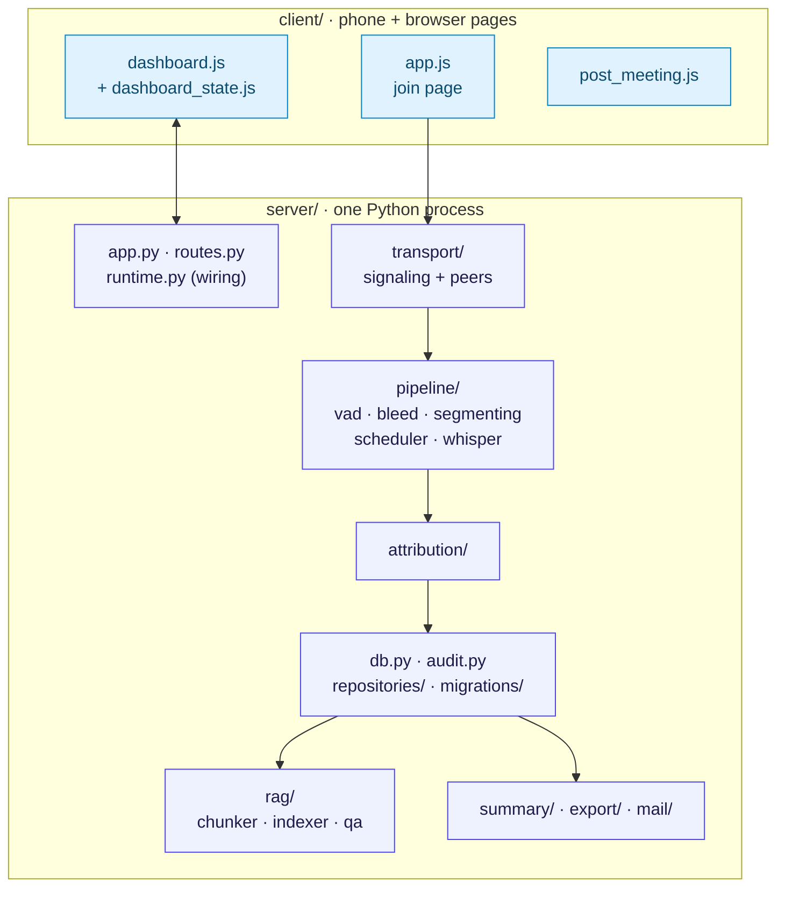
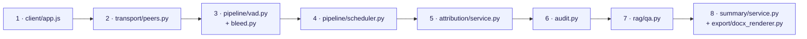
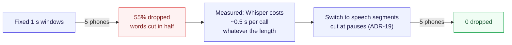

# Convene — builder's walkthrough

How to talk about Convene as the person who built it: the story of how it was built, a file-by-file code tour, the
engineering problems we hit and how we solved them, the trade-offs, and a practice drill. It's written in "we".
Switch to "I" where that's accurate.

Every story here comes from `logs/`, and every number is a measured result. Learn them. Specific details are what
convince judges you know the codebase.

> **Rule for Q&A:** if you don't remember something, say "let me show you" and open the file from the tour in
> Part 3. Opening the right file quickly is more convincing than a perfect recited answer.

---

## Part 1 — The origin story (60 seconds, say it naturally)

> "We started from a small WebRTC prototype we called DT-17: phones streaming audio to a laptop over local Wi-Fi.
> It proved the transport, but it was a single aiohttp file with identities held in memory.
>
> Before writing features, we wrote the contracts: API, data model, events. Then we pinned the prototype's
> behaviour with tests so we could rewrite it safely. We moved it to FastAPI, added SQLite with a single audit path,
> and then built the pipeline in layers: speech-to-text, attribution, dashboard, search, Q&A, summary, DOCX.
>
> Every model choice was measured on the demo laptop, not picked from a blog post. We compared Whisper variants,
> three embedding models, and Llama against Qwen, and recorded 34 architecture decisions as we went."

### The build, in one diagram

---

## Part 2 — How the code is organised

| Folder | One-line explanation |
|---|---|
| `server/runtime.py` | Wires the whole system at startup: database, transport, STT pipeline, attribution, indexer, Q&A, summary |
| `server/transport/` | WebRTC peer per phone (`peers.py`), WebSocket signaling (`signaling.py`) |
| `server/pipeline/` | Audio → text: VAD, bleed filter, speech segmenter, fair scheduler, Whisper adapter |
| `server/attribution/` | Turns text into an `Utterance` with a speaker and confidence, and handles corrections |
| `server/rag/` | Chunking, embeddings, `sqlite-vec` search, grounded Q&A |
| `server/summary/`, `export/`, `mail/` | JSON summary with validation, deterministic DOCX, emailing the minutes |
| `server/audit.py` | The **only** place audit events are written |
| `server/migrations/` | 11 numbered SQL migrations, from `0001_core.sql` to `0011_participant_email.sql` |
| `config/convene.toml` | Every model ID and threshold. Nothing is hard-coded in the logic |
| `scripts/` | Measurement (`measure_stt.py`, `calibrate_qa.py`…), provisioning, `start_demo.sh`, `verify_local_only.py` |
| `tests/` | ~60 test files, ~820 non-model tests, plus `-m model` tests that use real weights |

---

## Part 3 — The code tour (if a judge says "show me the code")

Open the files in this order. It follows one spoken sentence from the phone to the DOCX.

| # | File (and where to scroll) | What to say while it's on screen |
|---|---|---|
| 1 | `client/app.js:13-34` | "The phone makes a UUID once and keeps it in localStorage per meeting, so a reconnect is the same person. Auto-gain is off on purpose: the bleed filter needs the near phone to stay louder." |
| 2 | `server/transport/peers.py` | "One `RTCPeerConnection` per phone, each with its own receive task. If one phone's session throws, the others don't notice." |
| 3 | `server/pipeline/vad.py:49-71` | "Each phone learns its own noise floor, the 10th percentile of the last five seconds. Speech has to be 9 dB above it." |
|   | `server/pipeline/bleed.py:75-107` | "Before transcribing, we check whether another phone heard the same loudness curve at least 6 dB louder. If so, this is an echo and we drop it. Any doubt means we keep it." |
| 4 | `server/pipeline/scheduler.py:131-163` | "Per-phone bounded queues and a round-robin ring. When we're overloaded we drop the oldest audio and write an audit event, so nothing disappears silently." |
| 5 | `server/attribution/service.py:82-103` | "The speaker comes from the device, not the voice. There are two confidences per line: transcription and attribution." |
|   | `server/attribution/service.py:113-138` | "A correction sets confidence to 1.0 but keeps `original_participant_id`, and the audit log has the full before and after." |
| 6 | `server/audit.py:18-55` | "One function writes every audit event. It checks the event against a catalogue and writes it in the same transaction as the change, and the dashboard is fed from it after commit. A test scans the source to make sure nothing else inserts audit rows." |
| 7 | `server/rag/retrieval.py:44-62` | "The search covers only this meeting and only lines said before the question was asked." |
|   | `server/rag/qa.py:355-418` | "If nothing clears the similarity threshold, the model isn't called. Citations come from our database, never from the model's text." |
| 8 | `server/summary/service.py:191-240` | "At most one retry, only for invalid JSON, and the retry prompt says exactly what was wrong. A model crash isn't retried." |
|   | `server/export/docx_renderer.py:28` | "Pure function with no I/O. We even pin the document timestamps so the same input produces the same file." |

---

## Part 4 — Engineering stories (the problems we hit)

These show that you built it. Each one is a problem, what we measured and what we changed. Have two or three ready.

### Story 1 — "Our 1-second windows were dropping more than half the audio"

> "Our first design sent Whisper a fixed one-second window. With five synthetic phones talking, the queue overflowed
> and we dropped 274 windows, about 55%. The one-second cuts also split words: 'very tight' came out as 'very tough.
> height.' When we measured, we found a Whisper call costs about half a second whether the audio is one second or
> three. So the fix was fewer, longer calls: we cut at natural pauses instead of fixed intervals. Five phones went
> to zero drops."

### Story 2 — "A fan broke our voice detector"

> "Our first VAD only learned the background noise from frames it had already rejected. If steady noise was
> louder than the threshold, like a fan or hum, it was never rejected, so the floor never adapted and the gate stayed
> open forever. We measured it: 26 out of 26 windows passed on pure white noise. We changed the floor to the 10th
> percentile of the last five seconds, because speech has pauses and noise doesn't. Now silence and steady noise are
> gated and speech passes."

### Story 3 — "Picking the model: Llama beat Qwen on a question Qwen wouldn't answer"

> "We compared Llama 3.1 8B and Qwen 2.5 7B on the laptop, both 4-bit. Neither made anything up: 0 out of 36 for
> both. But Qwen refused one answerable question every time, 'How many users are invited to the beta?', so it got 33
> of 36 correct and Llama got 36. Llama uses half a gigabyte more memory, which we can afford."

### Story 4 — "The threshold alone can't catch everything, so we don't rely on it alone"

> "We calibrated the relevance threshold with a script, `calibrate_qa.py`: 12 answerable and 12 unanswerable
> questions, some of them deliberate near-misses. The score ranges overlap, so no single threshold separates them.
> We set 0.50, which keeps every answerable question and stops 5 of the 12 unanswerable ones before the model runs,
> including 'What's the capital of France?'. The rest reach the model, and the prompt makes it say NO_GROUNDING.
> That's why there are two layers."

### Story 5 — "The summary was valid JSON but bad minutes"

> "The first summary prompt produced valid JSON every time, 18 of 18, but the minutes were poor. It copied transcript
> lines in the first person, lost one person's task and duplicated others. We iterated: third-person minutes, one
> paragraph per topic, each task once, and 'let's meet again' is not an action item. The final prompt produced 0 parse
> failures and 0 invented owners across 18 runs."

### Story 6 — "Bugs we found in our own code by testing it hard"

> "A worker error in the scheduler used to make the window it was holding vanish without a trace. Now it's reported
> as failed and audited. We also ran mutation tests: we deliberately broke the segmenter in ten ways, and the tests
> caught all ten. One mutation in the scheduler slipped through at first because an outer safety net hid it. We
> added an assertion so that an ordinary model failure is never counted as a worker crash."

### Story 7 — "Two phones hearing one voice"

> "When Priya talks loudly, Marcus's phone picks her up, so her words showed up under his name. We didn't want voice
> recognition for this. Instead, every phone already records its loudness every 20 ms. For each segment we check
> whether another phone's loudness curve rises and falls with it (correlation of at least 0.7, allowing ±300 ms of
> clock drift) and whether that phone heard it at least 6 dB louder. If both are true, it's an echo. Two people
> talking at once produce different curves, so both are kept."

---

## Part 5 — Trade-offs we chose (and what we rejected)

| We chose | Instead of | Why |
|---|---|---|
| Device = speaker | Voice diarization | Diarization is unreliable in real rooms, and the phone already tells us who's speaking (ADR-02) |
| One Python process | Separate Node + Python services | One process is easier to run, debug and demo on one laptop (ADR-01) |
| SQLite + `sqlite-vec` | Postgres, or a vector database like Chroma | Nothing to install; transcript and vectors in one file (ADR-07/08) |
| WebRTC for audio | Sending audio chunks over WebSocket | Browsers already handle Opus, jitter buffering and echo cancellation (ADR-09) |
| AI outputs JSON, code builds the DOCX | AI writes the document | Checkable output and the same document every time (ADR-12) |
| Retrieval only on an explicit question | Auto-injecting context | Predictable cost, and it never interferes with live transcription (ADR-11) |
| Local models, cloud only if switched on | Cloud with local fallback | Privacy is the product. We never fall back to the cloud automatically (ADR-06) |
| Models chosen by resource type in config | Model names in the code | Swapping Whisper or Llama is a config edit (ADR-14) |
| Drop oldest on overload | Block or drop newest | The live view stays current, and every drop is audited |

---

## Part 6 — Practice drill

Cover the right column and answer out loud. If you can answer all of these without looking, you're ready.

| Question | Answer | Where it lives |
|---|---|---|
| How does a phone keep its identity after Wi-Fi drops? | UUID in localStorage, and registration is idempotent | `client/app.js:30`, `server/registry.py:172` |
| What sample rate goes to Whisper? | 16 kHz mono, resampled from 48 kHz Opus | `server/pipeline/` |
| How big is a VAD frame? | 20 ms | `vad.py:19` |
| What's the VAD margin, and why that value? | 9 dB. 12 dB lost quiet speech, and 6 dB let pink noise through | `logs/stt.md`, `config/convene.toml` |
| What confidence does a device-attributed line get? | 0.95 (configurable). A manual correction gets 1.0 | `attribution/service.py:92,124` |
| What stops the AI from making up an answer? | Similarity threshold 0.50 before the model, the NO_GROUNDING prompt, citations from the DB | `rag/qa.py`, `rag/retrieval.py` |
| Can a question see things said after it was asked? | No. There's an "as of" filter on each chunk's first line | `retrieval.py:56` |
| How many retries for the summary? | One, and only for invalid output | `summary/service.py:199` |
| How is an action-item owner decided? | Exact, case-insensitive name match with exactly one participant, otherwise null | `summary/service.py:60` |
| Embedding model and dimension? | BGE-small-en-v1.5, 384 dimensions | `docs/models.md` |
| How long until a new line is searchable? | ~2 s (mostly a deliberate 2 s wait for the line to settle) | `logs/rag.md` |
| Memory for all models? | ~8 GB: Llama 5.5, Whisper 1.8, BGE 0.6 | `docs/models.md` |
| How do you prove it's offline? | `verify_local_only.py` samples open connections, and the tests block every non-loopback socket | `scripts/`, `logs/qa.md` |
| How many database migrations? | 11 | `server/migrations/` |
| How many architecture decisions? | 34 ADRs | `docs/decisions.md` |

---

## Part 7 — If someone asks how you built it so fast

Many hackathons ask about AI tool use, and some require you to disclose it. A true, confident answer works best:

> "We designed the architecture and the contracts first, then used AI coding tools heavily to implement against
> them, with tests and measurements checking every step. The decisions, the measurements and the trade-offs above
> are ours. That's also why everything is written down in 34 ADRs and the work logs."

This answer is safe, it impresses judges, and it holds up if anyone checks the repo history. Claiming you
hand-wrote every line can backfire if a judge digs in.
