# Convene — presentation kit

Mermaid diagrams, key numbers and a slide outline for presenting Convene. Every figure comes from `logs/`,
`docs/models.md` or `docs/decisions.md`. Paste any ```` ```mermaid ```` block into
[mermaid.live](https://mermaid.live) to export PNG/SVG for slides. GitHub and VS Code render them in place.

Status note for the presenter: the features below are **built and covered by automated tests**. Real-phone checks
so far: one phone, end to end (2026-09-25), and one real email send (2026-09-30). The multi-phone, offline
Wi-Fi-off and three-run rehearsal checks (CON-12, CON-15) are **not run yet**. Section 12 lists what is verified.
Don't claim more than that on stage.

---

## 1. The pitch in one slide

> **Every phone in the room becomes that person's microphone.** One laptop transcribes each phone on its own,
> knows who said what without guessing from voices, answers questions about the meeting as it happens, and
> gives you the minutes as a DOCX when you end it. Nothing leaves the room.

| Problem (from the brief) | Convene's answer |
|---|---|
| Minutes are written inconsistently | Structured summary + deterministic DOCX, the same template every time |
| "Who said that?" | Attribution by **device**, not by guessing from voices. Every line has a confidence score and can be corrected |
| Nobody can find what was decided | Live Q&A grounded in the transcript, with sources. It says "not discussed" rather than making something up |
| Commitments get lost | Action items you can edit across meetings (owner, due date, status, follow-up notes) |
| Policies are scattered and unversioned | Append-only policy repository that you can search with the same Q&A |
| No periodic reporting | Reports over a date range, built from stored data (no AI call) |
| Privacy | Runs on one laptop and a local Wi-Fi network, with local models. Cloud is only used if the operator turns it on |

---

## 2. System architecture

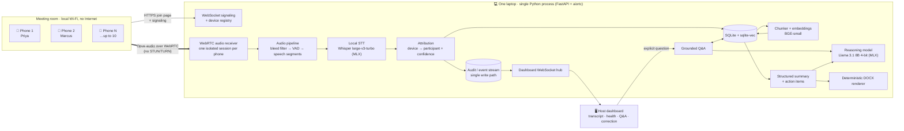

**Talking point:** it is one process on one laptop, with no microservices, no cloud and no accounts. WebRTC carries the
audio, a WebSocket carries control messages and live updates, and SQLite stores everything.

---

## 3. A meeting from start to finish

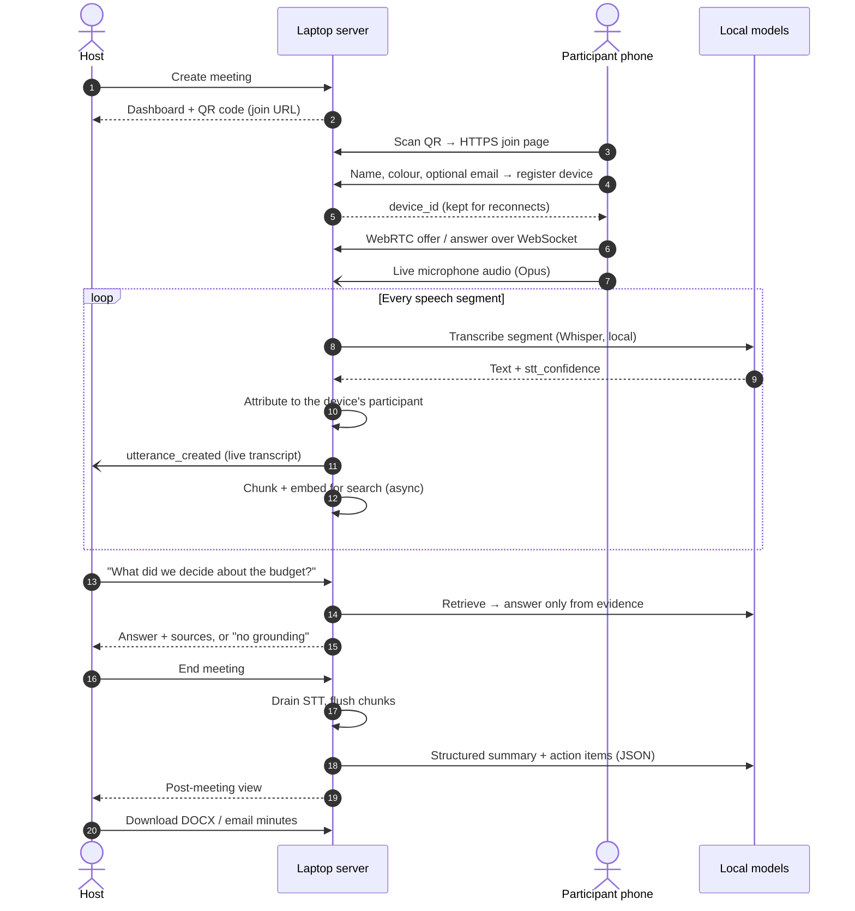

---

## 4. The audio pipeline (why it holds up with 5 phones)

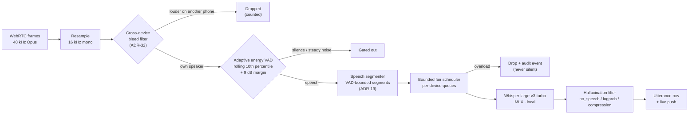

**The key change (ADR-19):** fixed ~1 s windows dropped **55%** of windows with 5 phones talking. Speech segments
cut at the pauses gave **zero drops** with 5 phones.

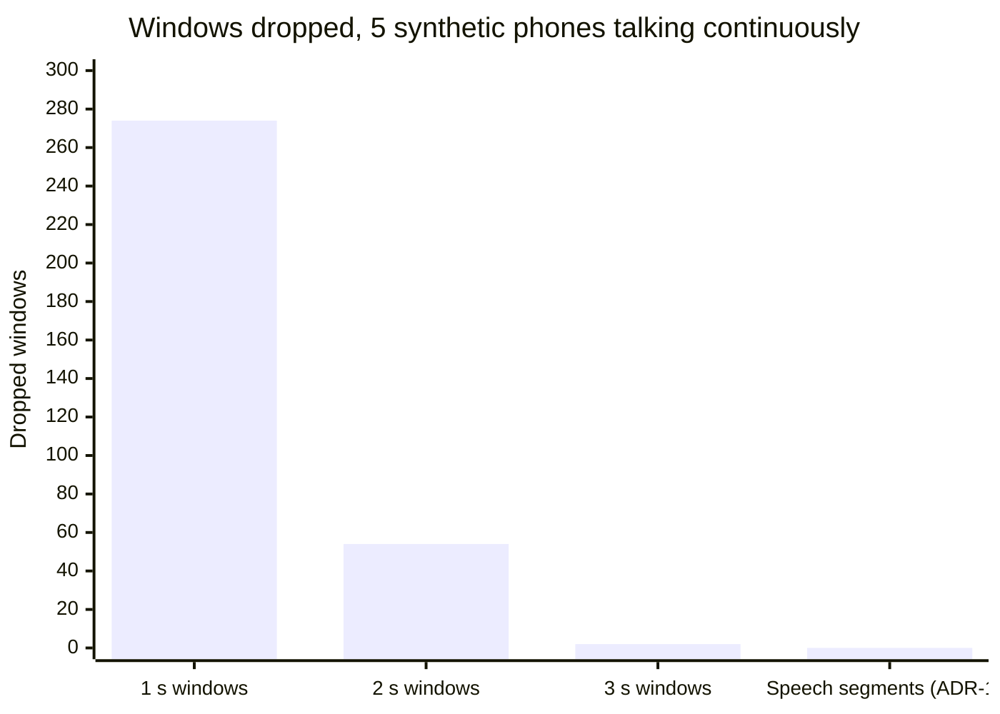

---

## 5. Attribution: who said it

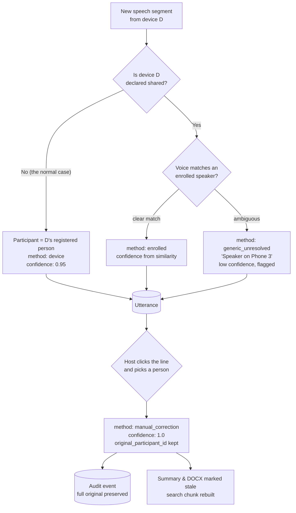

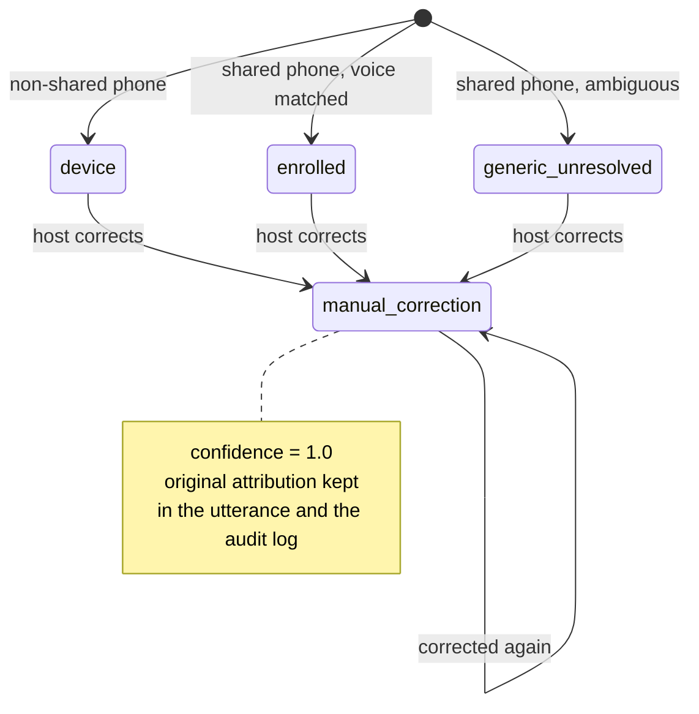

**Talking point:** diarization (guessing speakers from voices) is the weak part of most meeting tools. We avoid it:
one phone is one person, so we already know who is speaking. Shared phones are the only place that needs a guess, and the
guess comes with a confidence score that the host can correct.

---

## 6. Grounded Q&A: honest by design

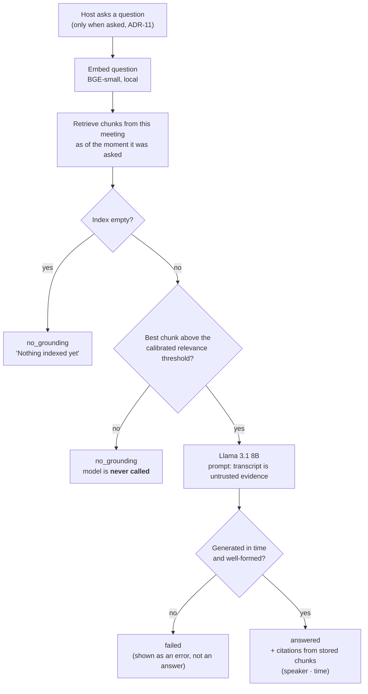

| Measured on the reference laptop (M4 Pro, 24 GB) | Result |
|---|---|
| Grounded questions answered correctly | **36 / 36** |
| Answers made up for questions the meeting never covered | **0 / 36** |
| Honesty gate (72 questions) | Passed |
| Answer time, median / max | **3.9 s / 4.8 s** |
| Network sockets opened during Q&A | 0 (in-process network block) |

---

## 7. Summary and minutes

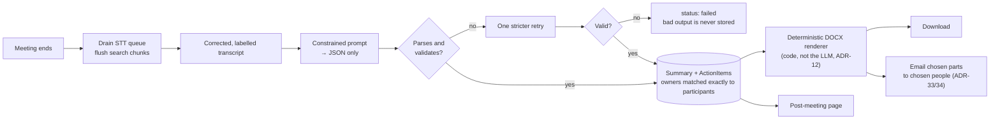

**Reliability measured:** 6 fixture meetings × 3 runs = 18 runs. Parse failures **0**, retries **0**, invented
owners **0**. At temperature 0 the three runs gave identical action items.

---

## 8. Data model (core entities)

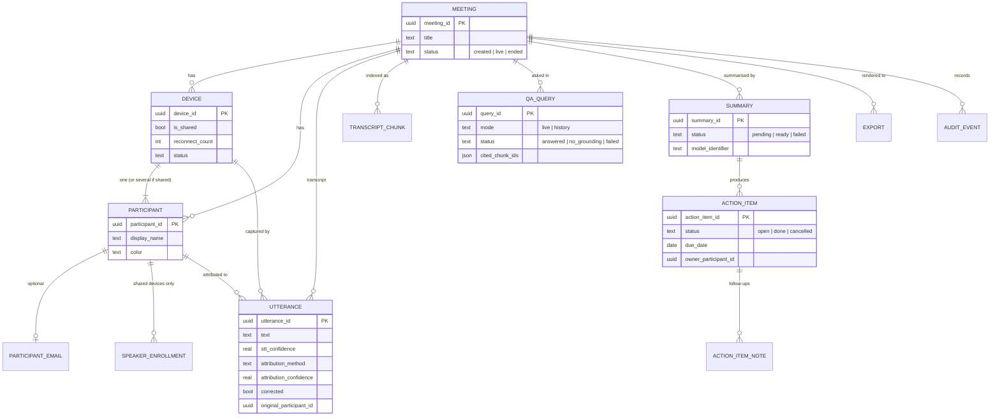

Policies are stored separately (`PolicyDocument` → `PolicyVersion`, append-only) with their own chunk and vector tables
in the same SQLite file (ADR-29).

---

## 9. Everything runs locally

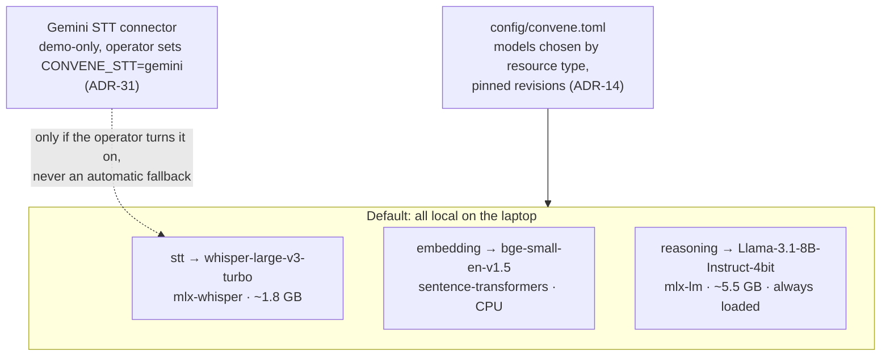

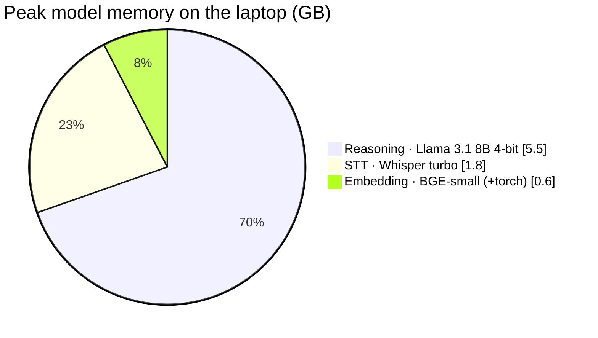

---

## 10. After the meeting: the organisation's record

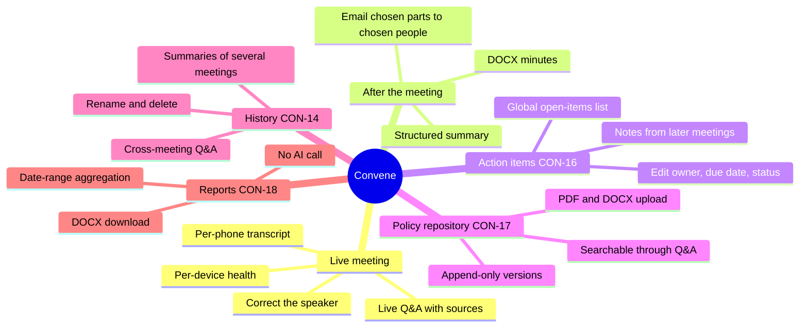

---

## 11. How it was built

### Task dependency graph

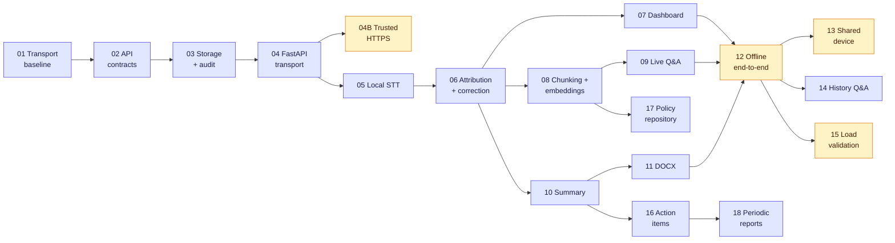

Indigo nodes are implemented with automated tests. Amber nodes still need real hardware, people or both.

### Timeline (from the work logs)

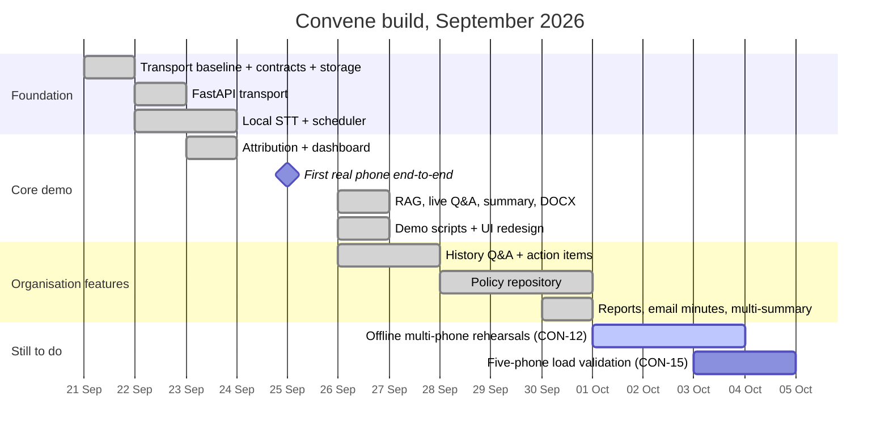

---

## 12. Key numbers and what is verified

| Metric | Value | Source |
|---|---|---|
| Automated tests (non-model suite) | **~820 passing** | `logs/email-report.md`, `logs/history.md` |
| STT model load / call | 1.3 s load · ~0.5–0.6 s per segment | `docs/models.md`, `logs/stt.md` |
| 5 phones, speech segments | **0 dropped**, event-loop lag p95 1 ms | `logs/stt.md` (synthetic) |
| Transcript line → searchable | ~2 s median, < 3 s target | `logs/rag.md` |
| STT latency with indexing on vs. off | No measurable slowdown | `logs/rag.md` |
| Q&A accuracy / fabrication | 36/36 correct · 0/36 fabricated | `logs/qa.md` |
| Summary structured-output failures | 0 of 18 runs | `logs/summary-export.md` |
| Network sockets during Q&A / summary | 0 (in-process network block) | `logs/qa.md`, `logs/summary-export.md` |
| Architecture decisions recorded | 34 ADRs | `docs/decisions.md` |

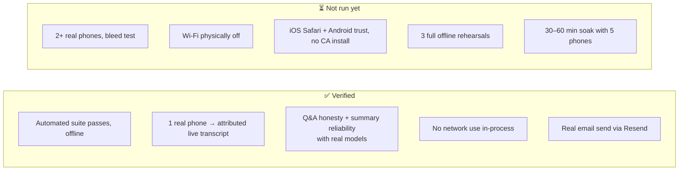

---

## 13. Suggested slide outline (8–10 minutes)

1. **Hook:** "Who agreed to what in your last meeting?" Show the problem-statement lines.
2. **Idea:** every phone is a microphone and one laptop does the rest (Section 1).
3. **Live demo, part 1:** scan the QR code, speak, and watch the attributed transcript appear.
4. **Architecture** (Section 2): one process, WebRTC + WebSocket, SQLite.
5. **Why attribution is right** (Section 5): identity comes from the device, with confidence and correction.
6. **Live demo, part 2:** ask a question → cited answer. Ask about something never discussed → "no grounding".
7. **Honesty numbers** (Section 6 table).
8. **End the meeting:** summary → DOCX → email (Section 7).
9. **Beyond one meeting** (Section 10): action items, policies, reports, history.
10. **Engineering rigour:** pipeline drops chart (Section 4) + key numbers (Section 12).
11. **What's next:** shared-device voice enrollment, five-phone load validation, offline rehearsal.

### Demo backup plan
- Pre-recorded video of the full flow (planned in CON-12; record it before the demo).
- `scripts/start_demo.sh` for one-command startup; `scripts/verify_local_only.py` to show judges no public
  connections are open.
